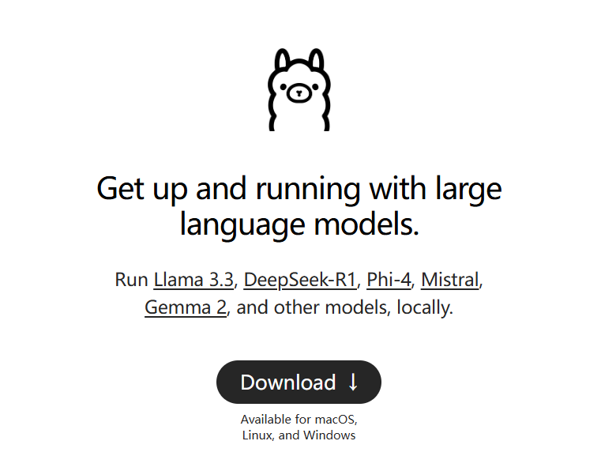
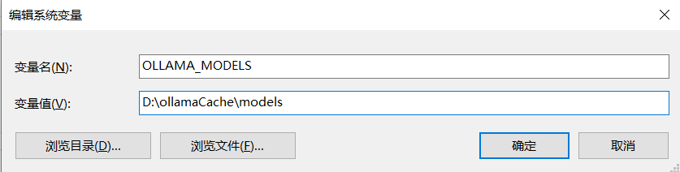
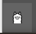
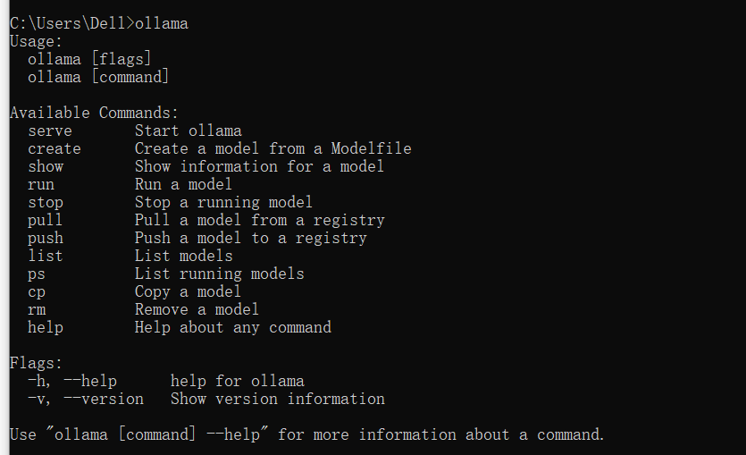
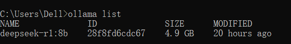
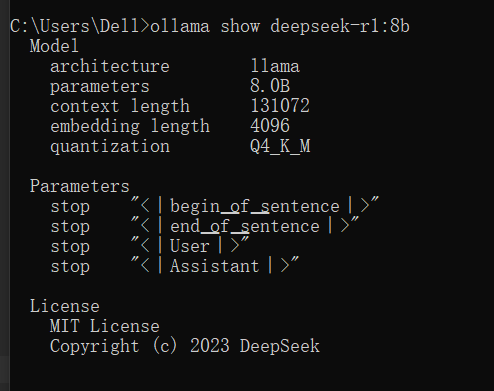
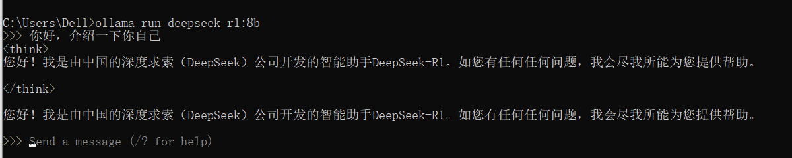
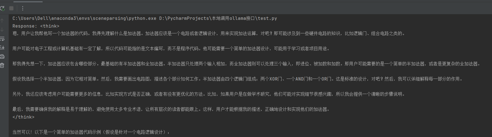

在自己电脑上搭建开源的大模型，如deepseek-r1, qwen等等。
1. 使用ollama管理大模型
地址：https://ollama.com/


Ollama 是一款跨平台推理框架客户端（MacOS、Windows、Linux），专为无缝部署大型语言模型（LLM）（如 Llama 2、Mistral、Llava 等）而设计。通过一键式设置，Ollama 可以在本地运行 LLM，将所有交互数据保存在自己的机器上，从而提高数据的私密性和安全性。

**注意：ollama默认是安装在C盘且不能修改。**

可以设置下载的模型文件的存放目录，默认会存放在C盘。设置环境变量**OLLAMA_MODELS**


下载后直接安装即可。安装完成后，可以看到 Ollama 已经默认运行了。可以通过底部的导航栏找到 Ollama 标志，并右键后点击 Quit Ollama 退出Ollama或者查看 logs。



打开命令窗口，输入ollama, 可以看到ollama支持的命令。


Ollama默认端口是11434，可以修改环境变量OLLAMA_PORT自定义。服务默认是 http://localhost:11434，在浏览器打开该地址，可以看到字符串：ollama is running。

**目前 Ollama 在 Windows 系统下默认开机自启，需要自己手动关闭。**

2. 下载模型

在命令窗口输入 ollama run deepseek-r1:8b，下载大模型到本地电脑。

使用ollama list 可以查看当前已经安装的大模型


ollama show deepseek-r1:8b 查看模型的信息


3. 运行模型
ollama run deepseek-r1:8b 与大模型对话


ctrl+d 可以终止对话。

4. 调用ollama接口
pip install requests 执行以下代码，可以调用ollama接口。
```python
import requests
url = "http://localhost:11434/api/generate"
payload = {
    "model": "deepseek-r1:8b",
    "prompt": "帮我写一个加法器代码",
    "stream": False
}
response = requests.post(url, json=payload)
print("Response:", response.json()['response'])
```
